# War Thunder &times; Stream Deck

> Drive every War Thunder cockpit toggle, weapon trigger, and sensor switch from your Elgato Stream Deck &mdash; without rebinding a single key.

[](LICENSE)
[](#requirements)
[](https://docs.elgato.com/sdk)
[](#the-18-modules)

The plugin reads your existing War Thunder `controls.blk`, looks up which keyboard key you bound to each in-game action, and presses that same key when you tap a Stream Deck button. **No new bindings, no rebinding, no losing your muscle memory.**

---

## Highlights

- **18 themed modules** &mdash; install only what you fly. Pure jet pilot? Skip the tank stuff. Heli main? Skip naval.
- **Native file picker** in the Property Inspector. Browse, Test, Save &mdash; done in five seconds.
- **Cross-plugin shared config.** Set the path once; every module you ever install reuses it automatically.
- **Live telemetry** for gear / flaps / air brake (read from `localhost:8111/state`) &mdash; the button shows the real position in&nbsp;%.
- **Fallback keys** (F13&ndash;F24, Pause, ScrollLock) for actions you haven't bound on keyboard yet.
- **Zero conflicts** with your existing keyboard. The plugin presses the *same key WT already knows* &mdash; if your G is "fire primary," tapping the deck just acts like another G.

---

## Quick start

1. Go to [Releases](../../releases/latest) and download the `.streamDeckPlugin` files for the modules you want.
2. **Double-click** any one. Stream Deck installs it.
3. Drag an action onto a key.
4. Property Inspector opens &rarr; **Browse** to your `machine.blk` &rarr; **Test** &rarr; **Save**.
5. Press the button. War Thunder reacts.

> Already have War Thunder at the standard install location? **Auto-detect handles it for free** &mdash; you never see the setup screen.

---

## How it works

```
+-------------+     +------------------+     +-------------------+     +------------------+
| Stream Deck | --> | WT plugin (.exe) | --> | Win32 SendInput   | --> | War Thunder      |
| button tap  |     |                  |     | virtual keypress  |     | (sees real key)  |
+-------------+     +-------+----------+     +-------------------+     +------------------+
                            |
                            | reads
                            v
                    +-----------------+
                    | machine.blk     |    "ID_GEAR -> G"
                    | (your bindings) |
                    +-----------------+
```

1. You configure the path to `machine.blk` once via the Property Inspector.
2. The path lives at `%LocalAppData%\WarThunderStreamDeck\config.json` &mdash; **shared across every module**.
3. When you tap a Stream Deck key, the plugin parses `machine.blk`, finds the keyboard scancode bound to e.g. `ID_GEAR`, and emits it via `SendInput`.
4. War Thunder receives an indistinguishable-from-real-keyboard key event and toggles the gear.

The plugin **never overwrites** your `.blk` and never injects bindings without your input. It is read-only against the controls file.

---

## The 18 modules

Each module ships as its own `.streamDeckPlugin`. Click any category below to see every action it includes &mdash; the **icon you'll see on your deck**, the action name, and the underlying War Thunder binding ID.

### &#9992;&#65039; Aircraft

<details>
<summary></summary>

> Gear, flaps, air brake, bay doors, cockpit doors, tail hook, WEP / boosters, VTOL.

| Icon | Action | War Thunder binding |
|:---:|---|---|
|  | Toggle Gear | `ID_GEAR` |
|  | Toggle Flaps | `ID_FLAPS`, `ID_FLAPS_DOWN`, `ID_FLAPS_UP` |
|  | Air Brake | `ID_AIR_BRAKE` |
|  | Air Reverse | `ID_AIR_REVERSE` |
|  | Bomb Bay Door | `ID_BAY_DOOR` |
|  | Cockpit Door | `ID_TOGGLE_COCKPIT_DOOR` |
|  | Carrier Tail Hook | `ID_TRANS_GEAR_DOWN` |
|  | Boosters / WEP | `ID_IGNITE_BOOSTERS` |
|  | VTOL Up | `vtol_rangeMax` |
|  | VTOL Down | `vtol_rangeMin` |

</details>

<details>
<summary></summary>

> Throttle Max / Min, Maneuverability mode.

| Icon | Action | War Thunder binding |
|:---:|---|---|
|  | Throttle Max | `throttle_rangeMax` |
|  | Throttle Min | `throttle_rangeMin` |
|  | Maneuverability Mode | `ID_MANEUVERABILITY_MODE` |

</details>

<details>
<summary></summary>

> Missiles (AAM), cannons, MGuns, additional guns, target lock, weapon lock, shooting cycle, reload, fire-axis.

| Icon | Action | War Thunder binding |
|:---:|---|---|
|  | Air-to-Air Missile | `ID_AAM` |
|  | Fire Primary | `ID_FIRE_PRIMARY` |
|  | Fire Secondary | `ID_FIRE_SECONDARY` |
|  | Fire Cannons | `ID_FIRE_CANNONS` |
|  | Fire MGuns | `ID_FIRE_MGUNS` |
|  | Fire Add. Guns | `ID_FIRE_ADDITIONAL_GUNS` |
|  | Lock Target | `ID_LOCK_TARGET` |
|  | Weapon Lock | `ID_WEAPON_LOCK` |
|  | Cycle Primary | `ID_SWITCH_SHOOTING_CYCLE_PRIMARY` |
|  | Cycle Secondary | `ID_SWITCH_SHOOTING_CYCLE_SECONDARY` |
|  | Reload Guns | `ID_RELOAD_GUNS` |
|  | Fire (Axis) | `fire_rangeMax` |

</details>

<details>
<summary></summary>

> AGM, ATGM, bombs, rockets (single & series), guided bombs (drop & lock), laser designator, ballistic computers, target lock / unlock.

| Icon | Action | War Thunder binding |
|:---:|---|---|
|  | Air-to-Ground Missile | `ID_AGM` |
|  | AGM Lock | `ID_AGM_LOCK` |
|  | ATGM | `ID_ATGM` |
|  | Drop Bomb | `ID_BOMBS` |
|  | Bomb Series | `ID_BOMBS_SERIES` |
|  | Fire Rockets | `ID_ROCKETS` |
|  | Rocket Series | `ID_ROCKETS_SERIES` |
|  | Drop Guided Bomb | `ID_GUIDED_BOMBS` |
|  | Guided Bomb Lock | `ID_GUIDED_BOMBS_LOCK` |
| 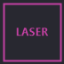 | Laser Designator | `ID_TOGGLE_LASER_DESIGNATOR` |
|  | Rocket Ballistics | `ID_TOGGLE_ROCKETS_BALLISTIC_COMPUTER` |
|  | Combined BC | `ID_TOGGLE_CANNONS_AND_ROCKETS_BALLISTIC_COMPUTER` |
|  | Designate Target | `ID_DESIGNATE_TARGET` |
|  | Lock Point | `ID_LOCK_TARGETING_AT_POINT` |
|  | Unlock Point | `ID_UNLOCK_TARGETING_AT_POINT` |

</details>

<details>
<summary></summary>

> Flares, IR projector, smoke screen.

| Icon | Action | War Thunder binding |
|:---:|---|---|
|  | Flares | `ID_FLARES` |
|  | IR Projector | `ID_IR_PROJECTOR` |
|  | Smoke Screen | `ID_SMOKE_SCREEN` |

</details>

<details>
<summary></summary>

> Radar power, mode switch, range, scan pattern, ACM mode, target lock & switch, type switch, lock / unlock designation.

| Icon | Action | War Thunder binding |
|:---:|---|---|
|  | Radar Power | `ID_SENSOR_SWITCH` |
|  | Mode Switch | `ID_SENSOR_MODE_SWITCH` |
|  | Range Switch | `ID_SENSOR_RANGE_SWITCH` |
|  | Scan Pattern | `ID_SENSOR_SCAN_PATTERN_SWITCH` |
|  | ACM Mode | `ID_SENSOR_ACM_SWITCH` |
|  | Target Lock | `ID_SENSOR_TARGET_LOCK`, `ID_LOCK_TARGET`, `ID_LOCK_TARGETING` |
|  | Target Switch | `ID_SENSOR_TARGET_SWITCH` |
|  | Type Switch | `ID_SENSOR_TYPE_SWITCH` |
|  | Lock Designation | `ID_LOCK_TARGETING` |
|  | Unlock Designation | `ID_UNLOCK_TARGETING` |

</details>

<details>
<summary></summary>

> Thermal polarity, night vision, designate target, lock at point, cue X / Y / Z (max / min / center), laser designator, target & UAV cameras.

| Icon | Action | War Thunder binding |
|:---:|---|---|
|  | Thermal Polarity | `ID_THERMAL_WHITE_IS_HOT` |
|  | Night Vision | `ID_PLANE_NIGHT_VISION` |
|  | Designate Target | `ID_DESIGNATE_TARGET` |
|  | Lock at Point | `ID_LOCK_TARGETING_AT_POINT` |
|  | Cue X + | `sensor_cue_x_rangeMax` |
|  | Cue X &minus; | `sensor_cue_x_rangeMin` |
|  | Cue X Center | `sensor_cue_x_rangeSet` |
|  | Cue Y + | `sensor_cue_y_rangeMax` |
|  | Cue Y &minus; | `sensor_cue_y_rangeMin` |
|  | Cue Y Center | `sensor_cue_y_rangeSet` |
| 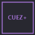 | Cue Z + | `sensor_cue_z_rangeMax` |
| 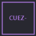 | Cue Z &minus; | `sensor_cue_z_rangeMin` |
|  | Cue Z Center | `sensor_cue_z_rangeSet` |
| 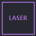 | Laser Designator | `ID_TOGGLE_LASER_DESIGNATOR` |
|  | Target Camera | `ID_TARGET_CAMERA` |
|  | UAV Camera | `ID_TOGGLE_UAV_CAMERA` |

</details>

### &#128642; Helicopter

<details>
<summary></summary>

> Helicopter gear, flaps Up / Down, air brake.

| Icon | Action | War Thunder binding |
|:---:|---|---|
|  | Heli Gear | `ID_GEAR_HELICOPTER` |
|  | Heli Flaps Up | `ID_FLAPS_UP_HELICOPTER` |
|  | Heli Flaps Down | `ID_FLAPS_DOWN_HELICOPTER` |
| 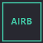 | Heli Air Brake | `ID_AIR_BRAKE_HELICOPTER` |

</details>

<details>
<summary></summary>

> Fire primary / secondary / MGuns / cannons / additional, rocket series, flares (single & series), ballistic computers, shooting cycle, instructor, exit cycle.

| Icon | Action | War Thunder binding |
|:---:|---|---|
|  | Heli Fire Primary | `ID_FIRE_PRIMARY_HELICOPTER` |
|  | Heli Fire Secondary | `ID_FIRE_SECONDARY_HELICOPTER` |
|  | Heli Fire MGuns | `ID_FIRE_MGUNS_HELICOPTER` |
|  | Heli Fire Cannons | `ID_FIRE_CANNONS_HELICOPTER` |
|  | Heli Fire Add Guns | `ID_FIRE_ADDITIONAL_GUNS_HELICOPTER` |
|  | Heli Rocket Series | `ID_ROCKETS_SERIES_HELICOPTER` |
|  | Heli Flare | `ID_FLARES_HELICOPTER` |
|  | Heli Flare Series | `ID_FLARES_SERIES_HELICOPTER` |
|  | Heli Rocket BC | `ID_TOGGLE_ROCKETS_BALLISTIC_COMPUTER_HELICOPTER` |
|  | Heli Combined BC | `ID_TOGGLE_CANNONS_AND_ROCKETS_BALLISTIC_COMPUTER_HELICOPTER` |
|  | Heli Cycle Primary | `ID_SWITCH_SHOOTING_CYCLE_PRIMARY_HELICOPTER` |
|  | Heli Cycle Sec | `ID_SWITCH_SHOOTING_CYCLE_SECONDARY_HELICOPTER` |
|  | Heli Instructor | `ID_TOGGLE_INSTRUCTOR_HELICOPTER` |
|  | Heli Exit Cycle | `ID_EXIT_SHOOTING_CYCLE_MODE_HELICOPTER` |

</details>

<details>
<summary></summary>

> Night vision, seeker camera, sensor switch & lock, laser designator, target camera, lock at point, cue X / Y axes.

| Icon | Action | War Thunder binding |
|:---:|---|---|
|  | Heli Night Vision | `ID_HELI_GUNNER_NIGHT_VISION` |
|  | Seeker Camera | `ID_CAMERA_SEEKER_HELICOPTER` |
|  | Sensor Switch | `ID_SENSOR_SWITCH_HELICOPTER` |
|  | Sensor Lock | `ID_SENSOR_TARGET_LOCK_HELICOPTER` |
| 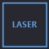 | Heli Laser | `ID_TOGGLE_LASER_DESIGNATOR_HELICOPTER` |
|  | Heli Target Cam | `ID_TARGET_CAMERA_HELICOPTER` |
|  | Heli Lock Point | `ID_LOCK_TARGETING_AT_POINT_HELICOPTER` |
|  | Heli Cue X + | `helicopter_sensor_cue_x_rangeMax` |
|  | Heli Cue X &minus; | `helicopter_sensor_cue_x_rangeMin` |
|  | Heli Cue Y + | `helicopter_sensor_cue_y_rangeMax` |
|  | Heli Cue Y &minus; | `helicopter_sensor_cue_y_rangeMin` |

</details>

### &#128666; Tank

<details>
<summary></summary>

> Direction driving toggle, suspension clearance up / down, pitch up / down, roll left / right, reset.

| Icon | Action | War Thunder binding |
|:---:|---|---|
|  | Direction Driving | `ID_ENABLE_GM_DIRECTION_DRIVING` |
|  | Suspension Up | `ID_SUSPENSION_CLEARANCE_UP` |
|  | Suspension Down | `ID_SUSPENSION_CLEARANCE_DOWN` |
|  | Pitch Up | `ID_SUSPENSION_PITCH_UP` |
|  | Pitch Down | `ID_SUSPENSION_PITCH_DOWN` |
|  | Roll Right | `ID_SUSPENSION_ROLL_UP` |
|  | Roll Left | `ID_SUSPENSION_ROLL_DOWN` |
|  | Suspension Reset | `ID_SUSPENSION_RESET` |

</details>

<details>
<summary></summary>

> Fire secondary & special, gun selection (primary / secondary / MG / reset), smoke, repair, hull aiming, reload.

| Icon | Action | War Thunder binding |
|:---:|---|---|
|  | Fire Secondary | `ID_FIRE_GM_SECONDARY_GUN` |
|  | Fire Special | `ID_FIRE_GM_SPECIAL_GUN` |
|  | Select Primary | `ID_SELECT_GM_GUN_PRIMARY` |
|  | Select Secondary | `ID_SELECT_GM_GUN_SECONDARY` |
|  | Select MG | `ID_SELECT_GM_GUN_MACHINEGUN` |
|  | Reset Selection | `ID_SELECT_GM_GUN_RESET` |
|  | Smoke Screen | `ID_SMOKE_SCREEN_GENERATOR` |
|  | Repair | `ID_REPAIR_TANK` |
|  | Hull Aiming | `ID_ENABLE_GM_HULL_AIMING` |
|  | Reload Guns | `ID_RELOAD_GUNS` |

</details>

<details>
<summary></summary>

> Rangefinder, targeting hold, zoom hold / toggle, crosshair light, night vision, fuse mode, thermal polarity, sight distance + / &minus; / set.

| Icon | Action | War Thunder binding |
|:---:|---|---|
|  | Rangefinder | `ID_RANGEFINDER` |
|  | Targeting Hold | `ID_TARGETING_HOLD_GM` |
|  | Zoom Hold | `ID_ZOOM_HOLD_GM` |
|  | Zoom Toggle | `ID_ZOOM_TOGGLE` |
|  | Crosshair Light | `ID_TOGGLE_GM_CROSSHAIR_LIGHTING` |
|  | Tank NV | `ID_TANK_NIGHT_VISION` |
|  | Fuse Mode | `ID_TANK_SWITCH_FUSE_MODE` |
|  | Thermal Polarity | `ID_THERMAL_WHITE_IS_HOT` |
|  | Sight Distance + | `gm_sight_distance_rangeMax` |
|  | Sight Distance &minus; | `gm_sight_distance_rangeMin` |
| 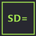 | Sight Distance = | `gm_sight_distance_rangeSet` |

</details>

<details>
<summary></summary>

> Tank radar power, mode, range, scan, target lock & switch, view switch, weapon lock, IRCM, APS lock.

| Icon | Action | War Thunder binding |
|:---:|---|---|
|  | Tank Sensor Switch | `ID_SENSOR_SWITCH_TANK` |
|  | Tank Mode Switch | `ID_SENSOR_MODE_SWITCH_TANK` |
|  | Tank Range Switch | `ID_SENSOR_RANGE_SWITCH_TANK` |
|  | Tank Scan Pattern | `ID_SENSOR_SCAN_PATTERN_SWITCH_TANK` |
|  | Tank Target Lock | `ID_SENSOR_TARGET_LOCK_TANK` |
|  | Tank Target Switch | `ID_SENSOR_TARGET_SWITCH_TANK` |
|  | Tank View Switch | `ID_SENSOR_VIEW_SWITCH_TANK` |
|  | Weapon Lock Tank | `ID_WEAPON_LOCK_TANK` |
|  | IRCM Switch | `ID_IRCM_SWITCH_TANK` |
|  | APS Lock | `ID_LOCK_TARGETING_AT_POINT_SHIP` |

</details>

### &#9875;&#65039; Naval

<details>
<summary></summary>

> Lock target, ship zoom max. _(Naval module is in early development; more actions coming.)_

| Icon | Action | War Thunder binding |
|:---:|---|---|
|  | Lock Target | `ID_LOCK_TARGETING_AT_POINT_SHIP` |
| 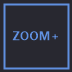 | Ship Zoom Max | `ship_zoom_rangeMax` |

</details>

### &#127916; Cross-vehicle

<details>
<summary></summary>

> Toggle view, helicopter view, camera neutral / down, driver / binoculars / target / UAV cameras, camera X / Y center.

| Icon | Action | War Thunder binding |
|:---:|---|---|
|  | Toggle View | `ID_TOGGLE_VIEW` |
|  | Heli View | `ID_TOGGLE_VIEW_HELICOPTER` |
|  | Camera Neutral | `ID_CAMERA_NEUTRAL` |
|  | View Down | `ID_CAMERA_VIEW_DOWN` |
|  | Driver Camera | `ID_CAMERA_DRIVER` |
|  | Binoculars | `ID_CAMERA_BINOCULARS` |
|  | Target Camera | `ID_TARGET_CAMERA` |
|  | UAV Camera | `ID_TOGGLE_UAV_CAMERA` |
|  | Cam X Center | `camx_rangeSet` |
|  | Cam Y Center | `camy_rangeSet` |

</details>

<details>
<summary></summary>

> Voice messages 1 / 2 / 5 / 7 / 8, push-to-talk, squad voice list, squad designate, support plane, plane orbit, multifunction wheel menu.

| Icon | Action | War Thunder binding |
|:---:|---|---|
|  | Voice Msg 1 | `ID_VOICE_MESSAGE_1` |
|  | Voice Msg 2 | `ID_VOICE_MESSAGE_2` |
|  | Voice Msg 5 | `ID_VOICE_MESSAGE_5` |
|  | Voice Msg 7 | `ID_VOICE_MESSAGE_7` |
|  | Voice Msg 8 | `ID_VOICE_MESSAGE_8` |
|  | Push to Talk | `ID_PTT` |
|  | Squad Voice List | `ID_SHOW_VOICE_MESSAGE_LIST_SQUAD` |
|  | Squad Designate | `ID_SQUAD_TARGET_DESIGNATION` |
|  | Support Plane | `ID_START_SUPPORT_PLANE` |
|  | Plane Orbit | `ID_SUPPORT_PLANE_ORBITING` |
|  | Wheel Menu | `ID_SHOW_MULTIFUNC_WHEEL_MENU` |

</details>

<details>
<summary></summary>

> Hide HUD, pause, screenshot, flight menu / setup, MP stats, instructor, action bar 5&ndash;9, continue, control mode (incl. UAV), shot frequency, exit cycle.

| Icon | Action | War Thunder binding |
|:---:|---|---|
|  | Hide HUD | `ID_HIDE_HUD` |
|  | Pause | `ID_GAME_PAUSE` |
| 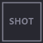 | Screenshot | `ID_SCREENSHOT` |
|  | Flight Menu | `ID_FLIGHTMENU` |
|  | Flight Setup | `ID_FLIGHTMENU_SETUP` |
| 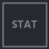 | MP Stat Screen | `ID_MPSTATSCREEN` |
|  | Instructor | `ID_TOGGLE_INSTRUCTOR` |
| 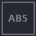 | Action Bar 5 | `ID_ACTION_BAR_ITEM_5` |
| 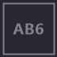 | Action Bar 6 | `ID_ACTION_BAR_ITEM_6` |
| 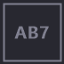 | Action Bar 7 | `ID_ACTION_BAR_ITEM_7` |
| 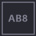 | Action Bar 8 | `ID_ACTION_BAR_ITEM_8` |
| 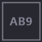 | Action Bar 9 | `ID_ACTION_BAR_ITEM_9` |
|  | Continue | `ID_CONTINUE` |
|  | Control Mode | `ID_CONTROL_MODE` |
|  | Control Mode UAV | `ID_CONTROL_MODE_HUMAN_UAV` |
|  | Shot Frequency | `ID_CHANGE_SHOT_FREQ` |
|  | Exit Cycle | `ID_EXIT_SHOOTING_CYCLE_MODE` |

</details>

> Source-of-truth spec: [`tools/spec/modules.psd1`](tools/spec/modules.psd1). Architecture: [`CATEGORIES.md`](CATEGORIES.md).

---

## Setup walkthrough

### First plugin you install

1. Drag any action onto a deck key.
2. Property Inspector opens. Top section is **Controls file (.blk)** with a `SHARED` badge.
3. Click **Browse&hellip;** &mdash; a native Windows file picker opens, defaulting to `Documents\My Games\WarThunder\Saves\`.
4. Pick `machine.blk` (or your custom controls preset).
5. Click **Test**. Status flips to green: `OK - 134 bindings loaded from ...`.
6. Click **Save**. The path is written to the shared config; every WT plugin you have or will install picks it up.
7. Tap the deck key. WT reacts.

### Every plugin you install after that

Buttons just work. No PI. No setup. The shared config already knows your path.

### Per-action fallback key (optional)

If a specific WT action isn't bound to any keyboard key in your `.blk`, tell the plugin which spare key to press instead:

1. Select the action's PI.
2. Choose **F13** (or any key from F13&ndash;F24, Pause, ScrollLock).
3. Save.
4. In WT, bind that same key to the matching action.

These keys are curated to be ones no physical keyboard has &mdash; **they collide with nothing.**

---

## Requirements

- **Windows 10/11** (Stream Deck plugin SDK is Windows-first; the plugin uses Win32 `SendInput`).
- **Elgato Stream Deck app** &ge; 6.5.
- **War Thunder** with the in-game **localhost telemetry server** enabled (it's on by default; reachable at `http://localhost:8111/state`).
- A `machine.blk` in your WT user folder (any keyboard binding you've ever set creates it).

The published plugins are **self-contained** &mdash; they include the .NET 9 runtime. No extra installs.

---

## Building from source

You only need this if you're modifying the plugin. End users just download from Releases.

```powershell
# Prereqs: .NET 9 SDK, PowerShell 5.1+, Stream Deck app
git clone https://github.com/BlackSiroGhost/WarThunderStreamDeck_Integration
cd WarThunderStreamDeck_Integration

# 1. Regenerate per-module C# projects + manifests + icons from the spec
./tools/generate.ps1

# 2. Build & install all 18 plugins to your local Stream Deck
./tools/deploy.ps1

# OR: build & pack into shareable .streamDeckPlugin archives
./tools/pack.ps1 -Version 0.5.0   # outputs to dist/
```

### Repository layout

```
WarThunderStreamDeck_Integration/
├── src/
│   ├── WarThunderStreamDeck.Core/           Shared library: BlkParser, key sender, telemetry,
│   │                                         BindingsCache, SharedConfig, WarThunderBindingAction
│   ├── WarThunderStreamDeck.Mechanisation/  Module exe (one per category)
│   ├── WarThunderStreamDeck.Engine/         ...
│   └── ... (16 more)
├── plugin/
│   ├── com.blacksiroghost.wt.mechanisation.sdPlugin/   manifest, icons, PI
│   └── ... (17 more)
├── tools/
│   ├── spec/modules.psd1     ⟵ source-of-truth: every action, every binding, every label
│   ├── generate.ps1          ⟵ codegen: spec → C# + manifests + icons
│   ├── deploy.ps1            ⟵ build + install + restart Stream Deck
│   └── pack.ps1              ⟵ produces .streamDeckPlugin archives
├── dist/                      (generated; gitignored)
├── CATEGORIES.md             Architecture & module taxonomy
├── INSTALL.md                End-user install guide
└── README.md
```

### Adding an action

Edit [`tools/spec/modules.psd1`](tools/spec/modules.psd1) and re-run `tools/generate.ps1`:

```powershell
@{ N='Eject Pilot';   U='eject';   T='Simple';   B=@('ID_EJECT_PILOT');   L='EJECT' }
```

That single line yields: a generated `EjectAction` C# class, an entry in the manifest, a generated PNG button icon with the `EJECT` label rendered at 72/144 px, and a Property Inspector binding. **No copy-paste, no manual JSON, no manual icon work.**

### Adding a module

Add a new `@{ Id=...; Asm=...; Cat=...; Accent=...; Actions=@(...) }` block to `modules.psd1`. The generator handles everything else.

---

## FAQ

**Q: Will my keyboard binds still work?**
Yes. The plugin sends the same key your keyboard sends. Both work in parallel.

**Q: Can two actions fire from one button press?**
Only if you bound two WT actions to the same key in WT itself. The plugin doesn't cause that &mdash; it just sends keys. To guarantee no collisions, use the F13&ndash;F24 fallback keys (one unique per action).

**Q: Does it cheat / read game memory?**
No. It reads the publicly-documented `localhost:8111/state` HTTP endpoint (live telemetry the game itself exposes). No memory access, no DLL injection, no protocol fakery. War Thunder itself ships this server for third-party tools.

**Q: Will Gaijin ban me?**
This is functionally identical to using a streamdeck-style HOTAS profile. The plugin presses real keys. Gaijin permits this category of tooling. **Use at your own discretion;** I take no responsibility for account actions.

**Q: My `.blk` is in a non-standard place.**
Use the **Browse&hellip;** button in the PI. Path resolution priority: shared config &rarr; per-plugin Stream Deck settings &rarr; auto-discover (`Documents\My Games\WarThunder\Saves\last\production\machine.blk`).

**Q: Does it work with custom control presets (`Steuerung.blk` etc.)?**
Yes. Browse to whichever `.blk` is your active loadout. The plugin reparses on file change.

**Q: Mac/Linux support?**
Not currently. Stream Deck SDK + WT both target Windows.

---

## Architecture deep-dive

For module taxonomy, the colour palette, the codegen rationale, and the friend-share UX design: see [`CATEGORIES.md`](CATEGORIES.md).

For the end-user install flow (the version you'd send to a friend along with a `.streamDeckPlugin` file): see [`INSTALL.md`](INSTALL.md).

---

## Contributing

Issues and PRs welcome. The codegen-from-spec design means most additions are a one-line edit to [`tools/spec/modules.psd1`](tools/spec/modules.psd1) followed by `./tools/generate.ps1`.

When opening a PR for a new action:
- Source the action ID from your own `machine.blk` (so you've verified WT actually exposes it).
- Pick a 4-character abbreviation (`L=`) that won't collide with siblings.
- Place it in the most thematically coherent existing module before considering a new one.

---

## License

[MIT](LICENSE) &mdash; do whatever you want, just keep the copyright notice.

War Thunder is a trademark of Gaijin Entertainment. This project is not affiliated with or endorsed by Gaijin.
